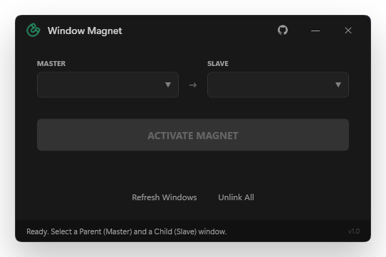

<div align="center">


# Window Magnet

[](https://github.com/voidksa/WindowMagnet/releases/latest)
[](LICENSE)

**A modern, powerful window management tool for Windows.**
Link windows together to create seamless workflows. Window Magnet allows you to "bond" a child window to a parent window, ensuring they move, minimize, and restore as a single unit. Perfect for multi-tasking, keeping reference material nearby, or managing complex window layouts.

<br>

<br>

</div>

---

## 🚀 Features

- **Window Bonding**: Select a "Master" and a "Child" window to link them together.
- **Synchronized Movement**: Moving the Master window automatically moves the Child window, maintaining their relative position.
- **State Synchronization**: Minimizing or restoring the Master window automatically applies the same action to the Child window.
- **Multiple Bonds**: Create multiple Master-Child pairs to organize your entire desktop.
- **Modern UI**: Sleek design with adaptive Dark/Light theme support matching your system.
- **Auto-Update**: Stay up-to-date with the latest features automatically.

## 📥 Installation

1. Download the latest `WindowMagnetSetup.exe` from the [Releases](https://github.com/voidksa/WindowMagnet/releases/latest) page.
2. Run the installer.
3. Enjoy!

## 🛠️ Development

Feel free to fork this repository and improve it! We encourage community contributions.

### Prerequisites
- .NET 8.0 SDK
- Visual Studio 2022 or compatible IDE

### Building
```bash
dotnet build
```

## 📄 License

This project is licensed under a modified MIT License - see the [LICENSE](LICENSE) file for details.
You are free to modify and distribute, but **you must preserve the original author's rights and the link to the original repository**.

---
<div align="center">
Made with ❤️ by <a href="https://github.com/voidksa">voidksa</a>
</div>